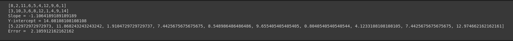
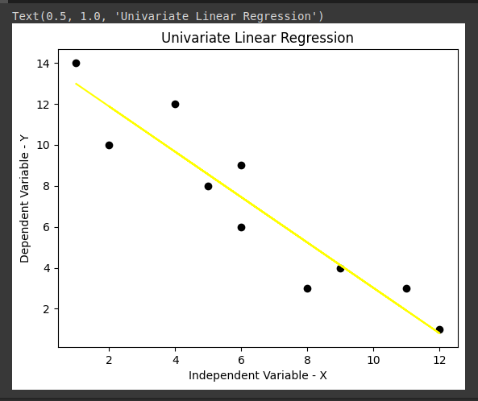

# Implementation of Univariate Linear Regression
## AIM:
To implement univariate Linear Regression to fit a straight line using least squares.

## Equipments Required:
1. Hardware – PCs
2. Anaconda – Python 3.7 Installation / Jupyter notebook

## Algorithm
1. Get the independent variable X and dependent variable Y.
2. Calculate the mean of the X -values and the mean of the Y -values.
3. Find the slope m of the line of best fit using the formula. 

4. Compute the y -intercept of the line by using the formula:

5. Use the slope m and the y -intercept to form the equation of the line.
6. Obtain the straight line equation Y=mX+b and plot the scatterplot.

## Program:
```python

# Program to implement univariate Linear Regression to fit a straight line using least squares.
# Developed by: Sam Israel D
# RegisterNumber:  212222230128

```
#### Importing necessary packages.
```python
import numpy as np
import seaborn as sns
import matplotlib.pyplot as plt
```

#### Finding the slope and y-intercept based on the user input.
```python
x = eval(input())
y = eval(input())
x1 = np.mean(x)
y1 = np.mean(y)
n=0
l=0
for i in range (0,len(x)):
    n +=((x[i]-x1)*(y[i]-y1))
    l += (x[i]-x1)**2
m = n/l
b = y1 - m*(x1)
print("Slope = {}".format(m))
print("Y-intercept = {}".format(b))
```

#### Calculating the error.
```python
yPred = []
for i in range(len(x)):
    yPred.append(m*x[i]+b)
print(yPred)
summation = []
for i in range(len(x)):
    summation.append((y[i]-yPred[i])**2)
error = sum(summation)/len(x)
print("Error = ",error)
```

#### Plotting the best-fit line.
```python
plt.scatter(x,y,color="black")
plt.plot(x,yPred,color="yellow")
plt.xlabel("Independent Variable - X")
plt.ylabel("Dependent Variable - Y")
plt.title("Univariate Linear Regression")
```

## Output:




## Result:
Thus, the univariate Linear Regression to fit a straight line using least squares has been implemented using python programming.
